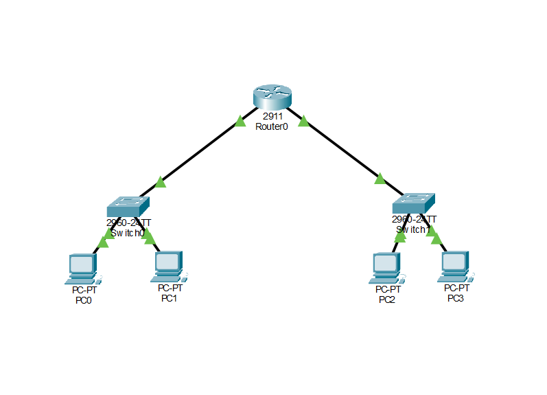
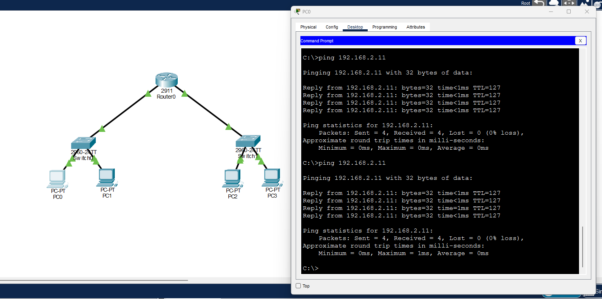

# Two-Subnet Routed Network

## Project overview

This Cisco Packet Tracer project demonstrates communication between two IPv4 subnets connected through a router.

Each subnet contains a switch and multiple PCs. The router has an interface in each subnet and acts as the default gateway, allowing devices on different subnets to communicate.

## Network topology

* Subnet 1: three PCs connected to Switch 1
* Subnet 2: two PCs connected to Switch 2
* One router connecting both switches
* Static IPv4 addressing used on all PCs

## IPv4 addressing

### Subnet 1 — 192.168.1.0/24

| Device | IPv4 address | Subnet mask   | Default gateway |
| ------ | ------------ | ------------- | --------------- |
| PC0    | 192.168.1.10 | 255.255.255.0 | 192.168.1.1     |
| PC1    | 192.168.1.11 | 255.255.255.0 | 192.168.1.1     |
| PC2    | 192.168.1.12 | 255.255.255.0 | 192.168.1.1     |

Router interface: `192.168.1.1`

### Subnet 2 — 192.168.2.0/24

| Device | IPv4 address | Subnet mask   | Default gateway |
| ------ | ------------ | ------------- | --------------- |
| PC3    | 192.168.2.10 | 255.255.255.0 | 192.168.2.1     |
| PC4    | 192.168.2.11 | 255.255.255.0 | 192.168.2.1     |

Router interface: `192.168.2.1`

## How the network works

Devices within the same subnet communicate through their local switch.

When a PC needs to communicate with a device on the other subnet, it recognises that the destination is outside its local network. It sends the data to its default gateway, which is the router interface on its subnet.

The router examines the destination IPv4 address and forwards the packet through its interface connected to the destination subnet.

## Testing

I tested communication between the two subnets by sending a ping from:

* Source: `192.168.1.10`
* Destination: `192.168.2.10`

The ping was successful, confirming that the addressing, default gateways and router interfaces were configured correctly.

## Skills demonstrated

* Building a network in Cisco Packet Tracer
* Connecting PCs, switches and a router
* Configuring static IPv4 addresses
* Using `/24` subnet masks
* Configuring default gateways
* Connecting and routing between two subnets
* Testing connectivity with ICMP ping
* Understanding the different roles of switches and routers

## Project file

Open `two-subnet-routed-network.pkt` using Cisco Packet Tracer to view and test the network.

## CLI Configuration Lab — 3 October 2026

I built a second network with four PCs, two Cisco 2960 switches and one Cisco 2911 router. I configured the router and switches using CLI, and entered the PCs’ static IP settings through Desktop → IP Configuration.

### IPv4 addressing

All devices use subnet mask `255.255.255.0`.

| Device | IPv4 address | Default gateway |
| --- | --- | --- |
| PC0 | 192.168.1.10 | 192.168.1.1 |
| PC1 | 192.168.1.11 | 192.168.1.1 |
| S1 management interface | 192.168.1.2 | 192.168.1.1 |
| R1 GigabitEthernet0/0 | 192.168.1.1 | N/A |
| PC2 | 192.168.2.10 | 192.168.2.1 |
| PC3 | 192.168.2.11 | 192.168.2.1 |
| S2 management interface | 192.168.2.2 | 192.168.2.1 |
| R1 GigabitEthernet0/1 | 192.168.2.1 | N/A |

### CLI configuration

- Assigned hostnames R1, S1 and S2.
- Configured IP addresses on both router interfaces.
- Enabled router interfaces using `no shutdown`.
- Configured switch management addresses on VLAN 1.
- Set each switch’s default gateway.
- Checked router interfaces using `show ip interface brief`.
- Saved configurations using `copy running-config startup-config`.

### Testing and troubleshooting

PC0 successfully pinged PC1 within the same subnet.

The initial ping from PC0 to PC3 failed because a PC’s default gateway was incorrect. I corrected the gateway and repeated the test. All four replies were received with 0% packet loss.

### Screenshots

### Project file

Open `two-subnet-cli-lab.pkt` in Cisco Packet Tracer.
